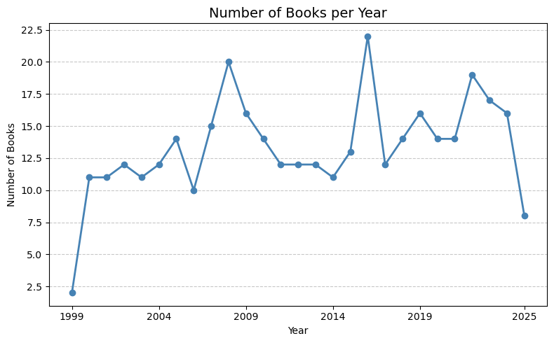
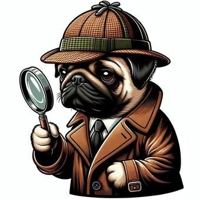
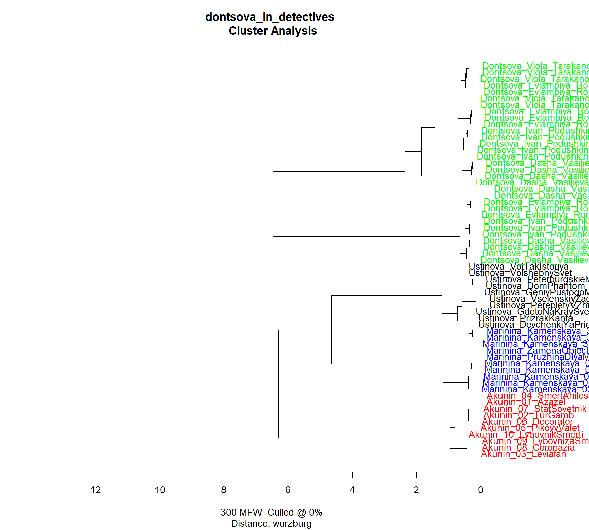
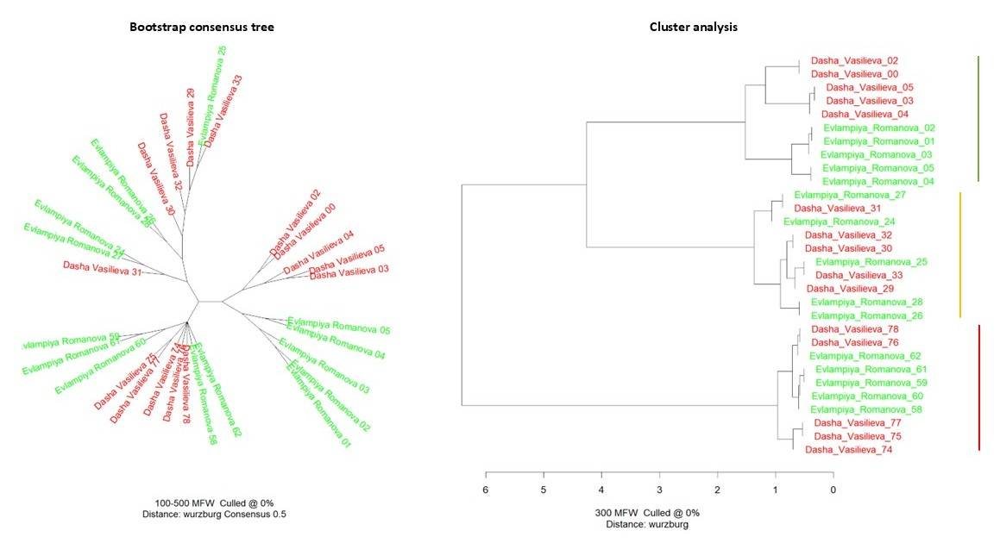
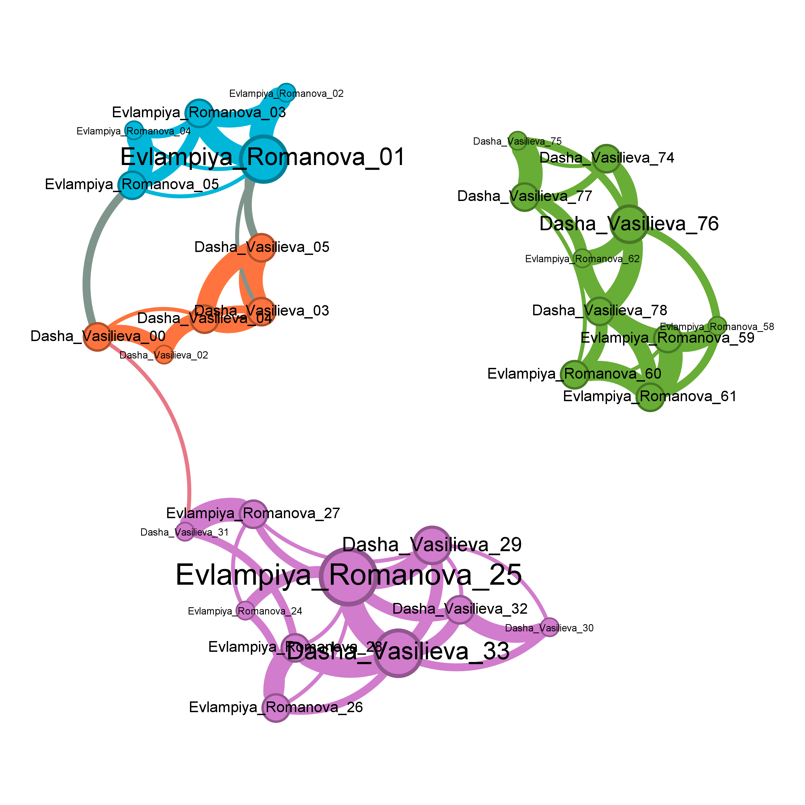
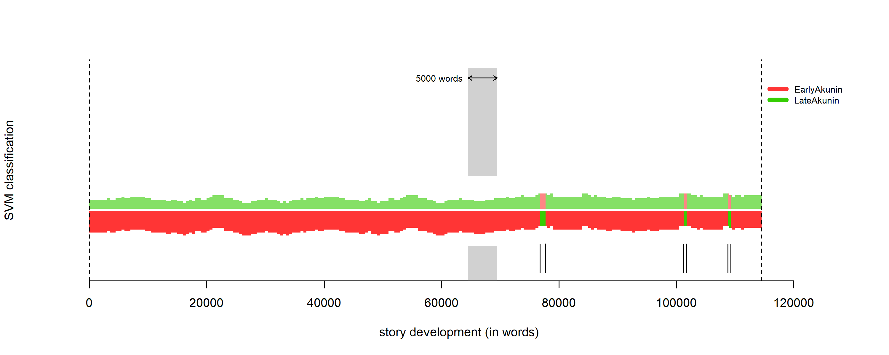
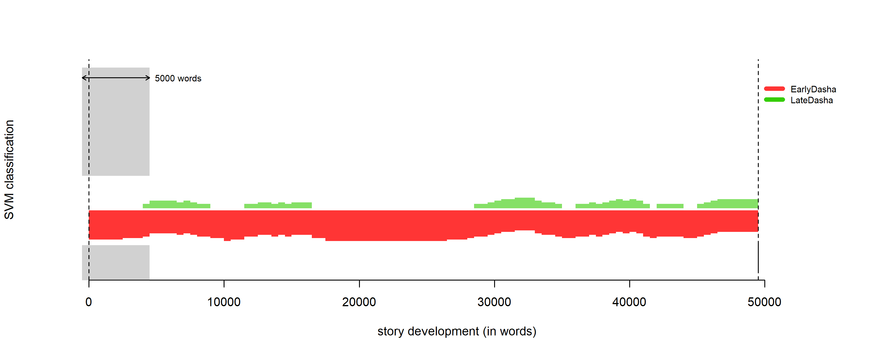
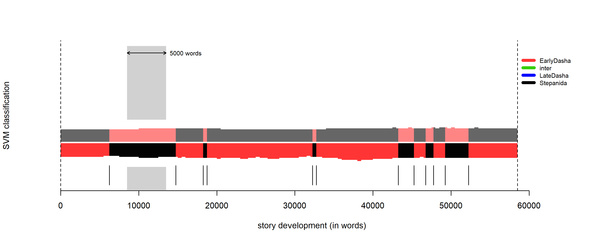
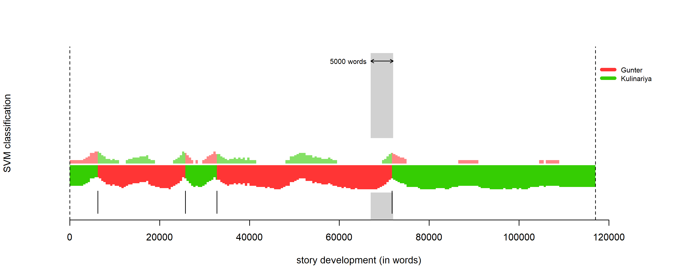

# Text Not Found ...

Here we present a work analyzing the authorship of books by a very productive writer and private detective enthusiast.  
She has been writing for 26 years and has already published **381 books**.  
This means she writes around **15 books per year** — or **1.2 per month**.  
 

Suspicious, isn’t it? Some people even believe that the writer’s pugs (yes, small dogs!) help her type the books. 🐕

*The real ghostwriters? We may never know...*

So, we decided to analyse the authorship of these books to shed light on this mystery. We also hope this project can inspire similar analyses in other fields.  
Of course, we do not claim **100% truth** in our conclusions — but you can join us on this journey to solve the riddle.

A small spoiler: we created a **pipeline for text authorship analysis using k-mers**. This is a new approach for stylometry, so be patient and read until the end!

## Data description

- **341 books** of the author of interest
- **10 other detective novels** (control group 1)
- **10 other detective novels** (control group 2)
- **10 other detective novels** (control group 3)
- **5 generated texts**
- **5 interviews**
- **2 fan-fiction**
- **And 6 pugs** (ok, that last one is a joke — actually 6 funny and positive people 😄)

## Required packages

1. **[Stylo](https://github.com/computationalstylistics/stylo)** (R package for stylometry)
2. **[spaCy](https://spacy.io/usage/spacy-101#whats-spacy)** (advanced NLP library for Python), used for preprocessing
3. **[GigaChain](https://github.com/ai-forever/gigachain)** used for text generation in the style of the author
4. **[scikit-learn](https://scikit-learn.org/stable/)** used for dimentionality reduction
5. [Библиотеки для topology]
6. **[NetworkX](https://networkx.org/documentation/stable/tutorial.html)** used for construction of graphs

## Data preparation

1) Books come in different formats, but we decided to use .txt. We wrote a converter from .fb2 → .txt, which can be found here: [fb2_txt_converter.py](code/fb2_txt_converter.py)

2) We tested several preprocessing methods (see [название файла]):

- Original text
- Lemmatized text (e.g., бегал → бегать, слону → слон)
- Lemmatized text without punctuation and stopwords (stopwords — the most common words in a language).
- Reduced to parts of speech (e.g., слон → NOUN, бегать → VERB) without stopwords/punctuation
- Parts of speech encoded as one-letter codes:
  - a = ADJ   (adjective)
  - b = ADP   (adposition)
  - c = ADV   (adverb)
  - etc...

## Generation of Neuroversion of our author books

## Analysis

1) We used the [stylo R package](https://github.com/computationalstylistics/stylo) — a standard tool in stylometry for comparing texts using word frequencies.

The analysis in the Stylo library is based on the Berrouz delta. This metric enables to determine the degree of similarity between texts. The most common words in a language (functional words: prepositions, pronouns, conjunctions, etc.) usually do not carry the main meaning, but their use varies extremely intuitively and subconsciously from author to author. These variations form a unique “stylistic fingerprint.” 

First, the frequencies of a MFW - Most Frequent Words are calculated across the entire corpus. Based on these frequencies, a distance matrix is then constructed for each pair of books in the corpus.

#### How does the author compare with other detective authors?

We have determined that our chosen author is clustered separately from other writers working in this style, which means that the characteristics of this author's style are not determined solely by their affiliation with a literary genre.

#### Changes in the author's style over time.

Thanks to stylometric metrics, it is possible to determine whether an author's style has changed over time. Our author is very prolific and has been writing continuously for over 20 years. Can we notice a difference in the style, and perhaps even the authorship, of their works? 

Yes! It can be said unequivocally that the author's early works bear little resemblance to his later ones and are completely different from his most recent ones. We are not ready to draw a definitive conclusion about the reasons for these observed patterns, but we assume that this is due either to extensive editing or plagiarism, or possibly to the book being written by a specially hired person.

#### Dynamic fingerprint

Using dynamic fingerprint, we can calculate how much of the text was written by each of several authors. We slice text by window of some words (eg 5000) and compare the text of interest with the corpus of the presumed co-authors.

"Good" author has stable fingerprint that has a stable style that does not change over time:

Our author has stable fingerprint in starts of career:

But after a while texts contains clear blocks of fragments that writed in different styles.

Plagiarism can also be confirmed using dynamic fingerprint methods. Here is a cookbook, significant portions of which were borrowed without attribution.

2) Based on word frequency tables from stylo, we applied dimentionality reduction:

- PCA
- tSNE

[картинки результатов и описание]

3) Topological analysis

The idea:

1. Get frequency of each word/POS (part of speech) in each book.
2. Compute pairwise distances (cosine distance).
3. Plot distances as a topological graph and tune parameters to detect clusters.

Details for math fans: [ссылка на статью]

[картинки результатов и описание]

4) Adaptation of k-mer analysis from bioinformatics

We wanted to analyze how much an author maintains its grammatical style, how it changes and evolves throughout the works. So we adapted k-mer frequency analysis to grammar patterns. For k from 2 to 10, we calculated frequency of POS sequences for each book. By comparing sets between books and with the general pool of k-dimensional sets, we can check how similar each text is to the next. Then we cluster the results.

[картинки результатов и описание]
